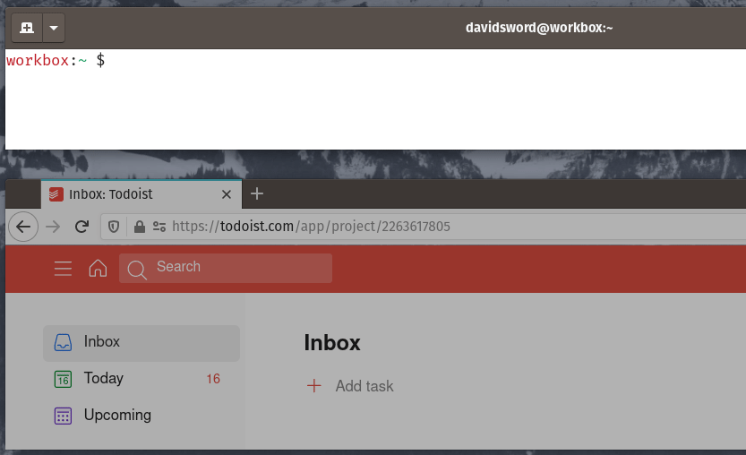

# Todoist CLI Quick Add

Add task to todoist.com inbox from short `+` command.

## Installation

Requires [node](https://nodejs.org/).

#### Download

```
git clone git@github.com:davidsword/todoist-cli-quick-add.git
cd todoist-cli-quick-add/
```

#### API Key

Create and edit a `.env` file:

```
vi .env
```

Add your token from todoist.com > Settings > Integrations > API Token:

```
TODOIST_API=yourtokenkeyhere
```

Save and close.

#### Install globally

```
npm install -g .
```

## Usage 

```
$ + pick up milk 
```


